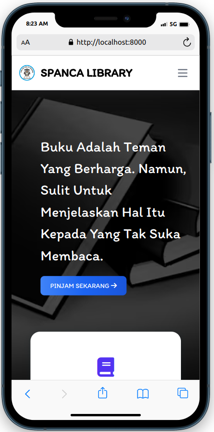

# Sistem Informasi Perpustakaan Online - Spanca Library

## Anggota Tim
1. Alan Pratama Rusfi
2. Achmad Surya Saputra
3. Aqilah Irsalina Ahmad
4. Ratna Solekhah
5. Yurika Putri Wardiani

## Deskripsi Projek Spanca Library
Projek ini adalah Sistem Informasi Perpustakaan Online yang diberi nama "Spanca Library". Projek ini bertujuan untuk menyediakan platform yang memudahkan pengelolaan dan akses informasi perpustakaan secara online dengan berbagai fitur yang dapat memudahkan kegiatan dalam perpustakaan, serta memproses data-data yang ada secara otomatis.

## Teknologi yang Digunakan
- **Framework:** Laravel
- **CSS Framework:** TailwindCss (Flowbite)

## Repositori Lebih Lengkapnya
Repositori lebih lengkapnya ada disini [Spanca Library Repository](https://github.com/AlanPratama/SpancaLibrary), karena saya tidak bisa git push di repositori [XI-PWPB](https://github.com/RPL-SMKN-65-JKT/XI-PWPB) dikarenakan masalah authentikasi/hak akses.

## Panduan Instalasi
1. Clone repositori ini: `git clone https://github.com/AlanPratama/SpancaLibrary.git`
2. Pindah ke direktori proyek: `cd SpancaLibrary`
3. Install dependencies: `composer install`
4. Salin file `.env.example` menjadi `.env` dan sesuaikan konfigurasi database.
5. Generate key aplikasi: `php artisan key:generate`
6. Migrasi database: `php artisan migrate`
7. Jalankan server: `php artisan serve`

Terima kasih atas perhatiannya!

## Sebagian Kecil Screenshots Aplikasi
**Admin**

